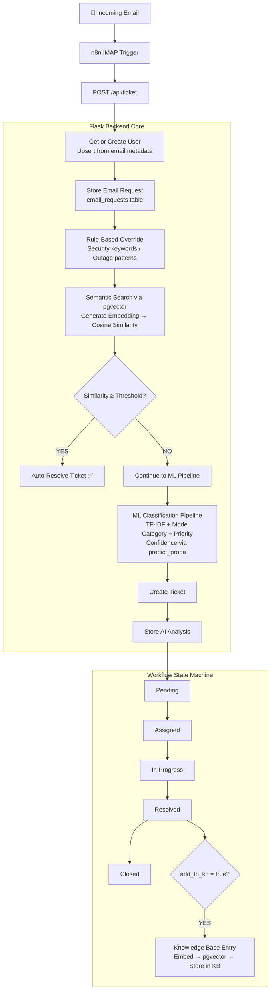

<div align="center">

# 🎫 SACK
### Smart Automated Classification & Knowledge — AI-Powered IT Ticketing System

[](https://www.python.org/)
[](https://flask.palletsprojects.com/)
[](https://supabase.com/)
[](https://github.com/pgvector/pgvector)
[](https://scikit-learn.org/)
[](https://n8n.io/)

> An end-to-end AI-powered IT support backend that ingests emails, classifies tickets intelligently, resolves known issues automatically via semantic search, and evolves through a self-learning knowledge base — all governed by a controlled finite state machine workflow.

</div>

---

## 📖 Table of Contents

- [Project Overview](#-project-overview)
- [Architecture](#-architecture)
- [Features](#-features)
- [AI & Machine Learning](#-ai--machine-learning)
- [Workflow Engine](#-workflow-engine)
- [Knowledge Base Automation](#-knowledge-base-automation)
- [Database Design](#-database-design)
- [Tech Stack](#-tech-stack)
- [Future Improvements](#-future-improvements)

---

## 🧠 Project Overview

**SACK** (Smart Automated Classification & Knowledge) is an AI-driven IT ticketing backend designed to reduce manual overhead in enterprise IT support. It automates the entire ticket lifecycle — from email ingestion to resolution and knowledge retention — using a combination of rule-based logic, machine learning classification, and semantic vector search.

The system is built around three core pillars:

1. **Intelligent Intake** — Emails are captured via n8n automation and processed by a Flask backend that creates users, stores raw requests, and runs AI classification.
2. **Controlled Workflow** — A finite state machine governs every ticket state transition, enforcing role-aware logic for assignment, progress tracking, resolution, and approval.
3. **Self-Learning Knowledge Base** — Approved resolutions are optionally embedded into a vector database, making them immediately available for future semantic auto-resolution.

This project demonstrates practical integration of NLP, vector databases, workflow automation, and backend engineering in a production-oriented system architecture.

---

## 🏗 Architecture



---

## ✨ Features

### Core Functionality
- **Email-Driven Ticket Creation** — Automatically ingests support emails via n8n's IMAP trigger, with zero manual intervention required to open a ticket.
- **AI-Powered Classification** — Two-stage classification: rule-based overrides for critical cases, followed by ML classification for standard requests.
- **Semantic Auto-Resolution** — Before creating a ticket, the system searches the knowledge base using vector embeddings. If a sufficiently similar resolution exists, the ticket is auto-resolved.
- **Structured Ticket Lifecycle** — Every ticket follows a strict, validated finite state machine. No illegal state transitions are possible.
- **Role-Aware Workflow** — Team leads assign tickets, members execute work, and leads approve or reject resolutions. Each action is ownership-validated.
- **Human-in-the-Loop Approval** — Resolutions require explicit approval before closure, ensuring quality control.
- **Self-Learning Knowledge Base** — Approved resolutions can be promoted to the knowledge base, enriching future auto-resolution capability.
- **Confidence Scoring** — ML predictions include probability scores, enabling downstream logic to act on confidence levels.
- **Full Audit Trail** — Every status transition is logged in `ticket_status_history` with timestamps and actor information.
- **Transaction-Safe Operations** — Database operations use connection pooling and transactional integrity via psycopg2.

### Operational Highlights
- HNSW vector index for sub-millisecond semantic search at scale
- Prevents duplicate active assignments per ticket
- Normalised relational schema with enforced foreign key constraints
- Embeddings stored as `vector(384)` using pgvector extension on Supabase

---

## 🤖 AI & Machine Learning

SACK's intelligence is delivered through a layered AI pipeline, each layer handling a different class of input:

### Layer 1 — Rule-Based Override
High-priority scenarios (security incidents, outages, data breaches) are detected using keyword pattern matching before any ML inference occurs. This ensures critical tickets are never misclassified and receive immediate escalation priority.

### Layer 2 — Semantic Similarity Search
Every incoming email is transformed into a dense vector embedding using `sentence-transformers` with the `thenlper/gte-small` model (384 dimensions). This embedding is compared against the knowledge base using cosine similarity via pgvector.

- If similarity score meets or exceeds the configured threshold, the system auto-resolves the ticket using the matched knowledge base article, logging the resolution and skipping manual assignment entirely.
- This dramatically reduces ticket volume for recurring known issues.

### Layer 3 — ML Classification Pipeline
For tickets that don't match existing knowledge, a scikit-learn pipeline is invoked:

- **Vectorisation:** TF-IDF on email body/subject text
- **Model:** Trained classification model (e.g. Logistic Regression / Random Forest)
- **Outputs:** Predicted category, priority level, and confidence score via `predict_proba()`
- **Storage:** All predictions stored in `ai_analysis` table alongside the raw ticket

### Embedding Model
| Property | Value |
|---|---|
| Model | `thenlper/gte-small` |
| Library | `sentence-transformers` |
| Dimensions | 384 |
| Index Type | HNSW (via pgvector) |
| Use Case | Knowledge base search + auto-resolution |

---

## ⚙️ Workflow Engine

SACK implements a fully validated finite state machine for ticket lifecycle management. Every transition is enforced at the application layer — no ticket can skip states or be acted upon by the wrong role.

### State Diagram

```
             ┌──────────────────────────────────────────────┐
             │                                              │
  [Created]  │  [Team Lead Assigns]   [Member Starts Work]  │
             ▼                                              │
          PENDING ──────────► ASSIGNED ──────────► IN PROGRESS
                                  ▲                     │
                                  │                     │ [Member Resolves]
                        [Rejected]│                     ▼
                                  │                  RESOLVED
                                  │                     │
                                  └──── APPROVAL ───────┘
                                        │
                                        ▼
                                     CLOSED ✅
```

### Transition Rules

| Transition | Actor | Conditions | Effect |
|---|---|---|---|
| `Pending → Assigned` | Team Lead | Ticket must be Pending; member must belong to lead's team; no active assignment exists | Creates assignment record, logs transition |
| `Assigned → In Progress` | Team Member | Ticket must be Assigned; requester must be the assigned member | Updates status, logs transition |
| `In Progress → Resolved` | Team Member | Ticket must be In Progress; ownership validated | Stores resolution in `resolution_documents`, logs transition |
| `Resolved → Closed` | Team Lead | Ticket must be Resolved | Closes ticket; optionally triggers KB entry generation |
| `Resolved → Assigned` | Team Lead | Ticket must be Resolved | Rejects resolution; ticket re-enters assignment queue |

---

## 📚 Knowledge Base Automation

The knowledge base is the system's memory — it grows smarter with every approved resolution.

### How It Works

When a team lead approves a resolution with the `add_to_kb: true` flag:

1. The resolution text is passed to the `gte-small` embedding model
2. A 384-dimensional vector is generated
3. The article (title, content, category, tags) and its embedding are inserted into `knowledge_base_articles`
4. The pgvector HNSW index immediately makes it searchable
5. The next time a similar issue arrives via email, the new article is a candidate for auto-resolution

This creates a **compounding return**: the more tickets that are resolved and approved, the more capable the auto-resolution system becomes — with no retraining required.

```
Approved Resolution
        │
        ▼
  Generate Embedding
  (gte-small, 384d)
        │
        ▼
  Insert into knowledge_base_articles
        │
        ▼
  HNSW Index Updated (pgvector)
        │
        ▼
  Available for Semantic Search ✅
```

---

## 🗄 Database Design

SACK uses a normalised PostgreSQL schema hosted on Supabase, with the pgvector extension enabled for vector storage and similarity search.

### Entity Relationship Summary

```
users
  └── email_requests (1:N)
  └── tickets (1:N, as requester)

team_leads
  └── team_members (1:N)
  └── ticket_assignments (1:N, as assigner)

tickets
  ├── ai_analysis (1:1)
  ├── ticket_assignments (1:N)
  ├── ticket_status_history (1:N)
  └── resolution_documents (1:1)

knowledge_base_articles
  └── embedding vector(384) [pgvector]
```

### Table Reference

| Table | Purpose |
|---|---|
| `users` | Stores all users who submit tickets via email |
| `team_leads` | Team lead accounts with assignment authority |
| `team_members` | Members belonging to a team lead, responsible for resolving tickets |
| `email_requests` | Raw email payloads stored before ticket creation |
| `tickets` | Core ticket records with status, priority, category |
| `ai_analysis` | Stores ML predictions, confidence scores, and resolution method |
| `ticket_assignments` | Maps tickets to assigned members, with assignment metadata |
| `ticket_status_history` | Immutable log of every status transition with timestamps |
| `resolution_documents` | Stores the resolution text written by the assigned member |
| `knowledge_base_articles` | Approved resolutions with vector embeddings for semantic search |

### Vector Search Configuration

```sql
-- pgvector extension
CREATE EXTENSION IF NOT EXISTS vector;

-- Knowledge base article embedding column
ALTER TABLE knowledge_base_articles ADD COLUMN embedding vector(384);

-- HNSW index for fast approximate nearest neighbour search
CREATE INDEX ON knowledge_base_articles
  USING hnsw (embedding vector_cosine_ops);
```

---

## 🛠 Tech Stack

| Layer | Technology | Purpose |
|---|---|---|
| **Backend** | Python 3.10+, Flask | REST API, business logic, AI pipeline orchestration |
| **Database** | PostgreSQL via Supabase | Relational data storage, vector search |
| **Vector Extension** | pgvector | Storing and querying 384-dim embeddings |
| **DB Driver** | psycopg2 (connection pooling) | PostgreSQL connectivity, transaction management |
| **ML / NLP** | scikit-learn | TF-IDF vectorisation, classification pipeline |
| **Embeddings** | sentence-transformers (`gte-small`) | Semantic embedding generation |
| **Workflow Automation** | n8n | IMAP email trigger, HTTP webhook to Flask |
| **Frontend** | React *(in progress)* | Dashboard for ticket management |

---


## 🔭 Future Improvements

| Area | Planned Feature |
|---|---|
| **Authentication** | JWT-based auth with role enforcement (Admin, Team Lead, Member, User) |
| **React Dashboard** | Full UI for ticket management, KB browsing, and analytics |
| **Active Learning** | Flag low-confidence ML predictions for human review and model retraining |
| **Email Notifications** | Automated status update emails to ticket submitters |
| **Analytics Module** | Resolution time metrics, category distribution, auto-resolution rate |
| **Multi-Tenant Support** | Organisation-scoped data isolation for SaaS deployment |
| **Escalation Rules** | SLA-based auto-escalation for unassigned or stale tickets |
| **Model Versioning** | Track and compare classifier performance across model versions |
| **Webhook Events** | Emit events on state transitions for third-party integrations (Slack, Teams) |
| **Docker Compose** | Containerised deployment for the full stack |

---

---

<div align="center">

Built with Python, Flask, pgvector, and sentence-transformers.

</div>